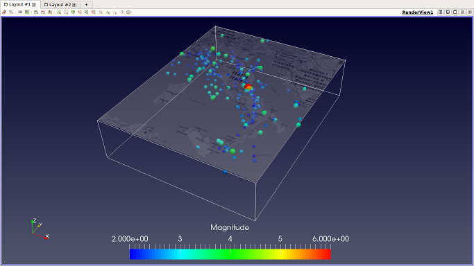

# Project

This project will deal with the visualization of earthquake data, which involves spatial and temporal events recorded from sensors around Italy. You can find further background on the dataset in the [instructions](ProjectHT2016.pdf) from previous years of this course.

Requirements to pass: Before the deadline, hand in visualizations from which it should be possible to answer the following questions about the dataset:

- Which are the earthquakes that occured in Italy over the last 365 days (from the time you downloaded the data)?
- Which are the 4+ magnitude earthquakes from the same period?
- What is the magnitude of each quake?
- Where on the surface (in 2D) is each quake located/projected?
- Where in the volume of the data (in 3D) are quakes most likely to occur?

Note that the example visualization in the screenshot below *does not* answer all of these questions, so you need to be creative with your solutions :)

## What to hand in

- A short (preferably no more than 1-2 pages of text in single or double-column format) report in PDF format describing your solution (including motivations for choice of glyphs, colormaps, etc.) and showing images of your visualizations. 
- If you want to submit a video (for example, if parts of your solution involves animation), you can use for instance [Open Broadcast Software (OBS) Studio](https://obsproject.com/) for recording.
- ParaView state files and data you have generated. Also include any additional files such as maps, scripts, etc. used in the visualization.

## Obtaining the source code and datasets

Download (or clone) the Git-repository of this assignment.

## Earthquake data

The file data_90days.txt contains a smaller version of the dataset (in CSV format). Run the script ExportPoints.py to export the data to a VTK polydata file that you can load into ParaView. To see the data in the rendering view, you might have to select Outline under Representation.

After playing around with the smaller dataset, you can go [here](http://cnt.rm.ingv.it) and download a larger and more recent dataset over Italy (remember to select English as language, and to restrict your search to include only data from Italy). You need to modify the Python script and run it again to generate a new VTK file for the larger dataset.

## Tips

- The default scale factor applied to depth values (originally given in kilometers) in the readPoints() function is 0.01. If you want to use a different scale factor (or for example map depth values on a logarithmic scale), you can change this in the Python scripts.
- There is a checkbox "Axes Grid" under Propertios->Annotation that toggles grid lines and axis annotations.
- To show 2D projections of the data, you can create additional RenderViews and toggle "Camera Parallel Projection" for each view under Properties->Orientation Axes.
- The Gaussian Resampling filter can be used to generate (splat) a volume from the data points. Useful if you want to show e.g. a heat map.
- You can use for example [OpenStreetMap](https://www.openstreetmap.org/export#map=6/40.338/15.645) to extract a map corresponding to the longitude and latitude of the data.
- If you hand in a video file, try to keep the file size of the video small (say, around 20 MB) by decreasing the recording quality in OBS Studio.
